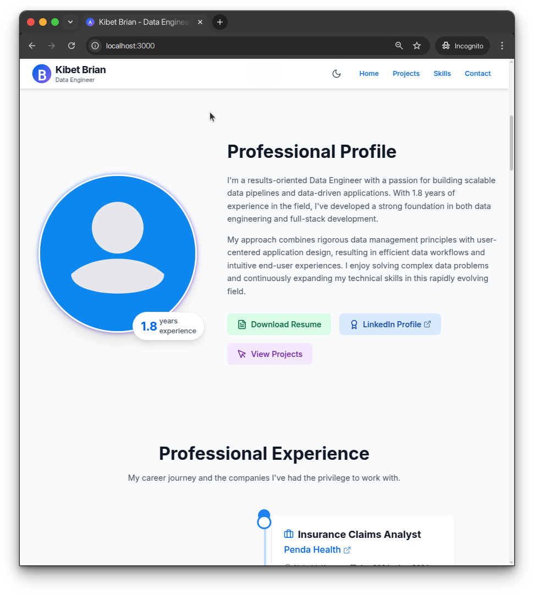

# Modern React Portfolio 



## Features
- Responsive for all devices
- Dark/Light mode toggle
- Smooth animations
- Fast performance
- Accessible design

## Tech Stack
- React & React Router
- Tailwind CSS
- Framer Motion
- Lucide Icons

## Sections
- Hero & About
- Experience Timeline
- Projects Showcase
- Skills Display
- Certifications
- Contact Form

## Quick Start
```bash
# Clone repository
git clone https://github.com/jk08y/kimutai-portfolio.git

# Install dependencies
npm install

# Start development server
npm start

# Build for production
npm run build
```

## Customization
Edit content in `/src/data` directory:
- projects.js
- skills.js
- workExperience.js
- certifications.js
- contactInfo.js

## Reuse & License
- Free to use, modify, and redistribute
- Perfect for personal portfolios
- MIT License - no attribution required

## Contact
Kimutai Joel - [kimutai@jkapp.pro](mailto:kimutai@jkapp.pro)
GitHub: [jk08y](https://github.com/jk08y)
Live: [pf.jkapp.pro](https://pf.jkapp.pro)

---
Built with care | Feel free to fork!
